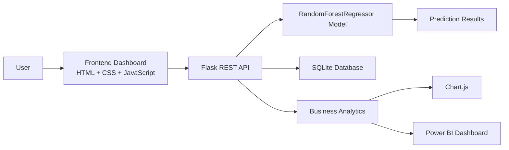

# AI Sales Intelligence SaaS

A Business Information System final project that brings together machine learning, business analytics, and a web-based SaaS dashboard for revenue forecasting and sales intelligence.

## Project Overview

AI Sales Intelligence SaaS is an intelligent business dashboard designed to help users monitor sales performance, forecast future revenue, and review model health from a single platform. The project combines a Flask REST API with a front-end dashboard built using HTML, CSS, and JavaScript, and integrates machine learning techniques to generate data-driven sales forecasts.

The platform is built around a Random Forest Regression model trained on structured sales data. It exposes prediction functionality, training workflows, historical tracking, and business analytics through a user-friendly interface.

## Business Problem

Businesses often need to understand how future sales performance may evolve based on historic signals such as order volume, quantity sold, and revenue lag indicators. Without an effective forecasting system, teams may struggle with:

- inaccurate revenue estimation
- limited visibility into sales trends
- weak decision-making for operations and planning
- inconsistent tracking of model performance over time

## Proposed AI Solution

The solution uses a machine learning-based revenue forecasting workflow that processes historical sales inputs and generates predictions through a Random Forest Regressor model. It includes:

- a prediction module for sales forecasting
- a model training module for retraining and evaluation
- a dashboard for business monitoring
- prediction history tracking
- analytics summaries and trend views
- Power BI integration for business reporting

By combining machine learning with an operational dashboard, the solution converts raw sales data into actionable business insight.

## System Architecture



## Main Features

- Revenue prediction using Random Forest Regression
- Flask API backend
- Web dashboard SaaS interface
- Prediction module
- Model training module
- Prediction history module
- Business analytics module
- Power BI dashboard integration

## Technology Stack

### Frontend
- HTML
- CSS
- JavaScript

### Backend
- Python
- Flask REST API

### Machine Learning
- scikit-learn
- RandomForestRegressor
- Pandas
- NumPy

### Visualization
- Chart.js
- Power BI

## Machine Learning Workflow

1. Load the sales dataset.
2. Prepare feature variables and target values.
3. Split the dataset into training and testing sets.
4. Train the Random Forest Regressor.
5. Evaluate the model using test data.
6. Save the trained model and related metadata.
7. Expose predictions through the API and dashboard.

## Model Evaluation

The current model used in this project is:

| Model | R² Accuracy | MAE | RMSE |
| --- | ---: | ---: | ---: |
| RandomForestRegressor | 91.53% | 805.70 | 2453.38 |

## Project Structure

```text
AI_Sales_Project
├── api/
│   ├── analytics.py
│   ├── app.py
│   ├── auth.py
│   ├── database.py
│   └── ml_train.py
├── website/
│   ├── pages/
│   │   ├── dashboard.html
│   │   ├── prediction.html
│   │   ├── history.html
│   │   ├── analytics.html
│   │   └── ...
│   ├── css/
│   ├── js/
│   └── assets/
├── model/
├── AI_SalesDataset_Orange.csv
├── train_model.py
├── evaluate_model.py
├── test_model.py
├── requirements.txt
├── README.md
└── .env
```

## Installation

1. Clone or download the project repository.
2. Navigate to the project root directory.
3. Create a virtual environment if needed.
4. Install the required dependencies:

```bash
pip install -r requirements.txt
```

## Render / Production Deployment

For production deployments such as Render, set the following environment variables before starting the app:

```bash
SECRET_KEY=replace-with-a-strong-secret
CORS_ORIGINS=https://your-frontend-domain.onrender.com
MODEL_URL=https://your-bucket.example.com/best_sales_model.pkl
# Optional override when you want to use a local path instead of the bundled model
# MODEL_PATH=api/model/best_sales_model.pkl
```

When `MODEL_URL` is present, the API downloads the model during startup and stores it in `api/model/production_model.pkl` for reuse. If no remote URL is configured, the app falls back to the bundled local model files in `api/model/`.

## How to Run the Project

### 1. Start the backend API

From the project root, run:

```bash
python api/app.py
```

This starts the Flask API on the local development server.

### 2. Serve the frontend

Open the web files through a local server. From the project root, run:

```bash
python -m http.server 8000
```

Then open the app in a browser:

- http://127.0.0.1:8000/login.html
- or http://127.0.0.1:8000/pages/dashboard.html

### 3. Use the system

- Log in through the auth screen
- View the dashboard
- Make a revenue prediction
- Review prediction history
- Analyze model performance and business metrics

## Screenshots

The following sections are placeholders for future screenshots and visual documentation.

### Dashboard
- Placeholder: dashboard overview screenshot to be added

### Prediction Page
- Placeholder: prediction form and result screenshot to be added

### Analytics View
- Placeholder: analytics charts screenshot to be added

### Model Training View
- Placeholder: model training workflow screenshot to be added

## Future Improvements

- Add automated retraining for new data updates
- Improve model comparison and benchmarking
- Add deeper forecasting views for weekly and monthly trends
- Expand reporting and export options
- Improve authentication and role-based access control
- Strengthen deployment and production configuration

## Author

This project was developed as part of a Business Information System final project focused on AI-powered business intelligence and revenue forecasting.

---

This project demonstrates how machine learning can be integrated into a business dashboard to support forecasting, analytics, and decision-making in a SaaS-style environment.
